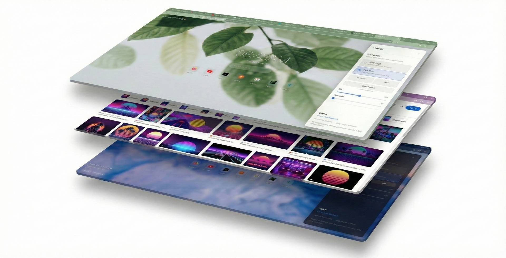
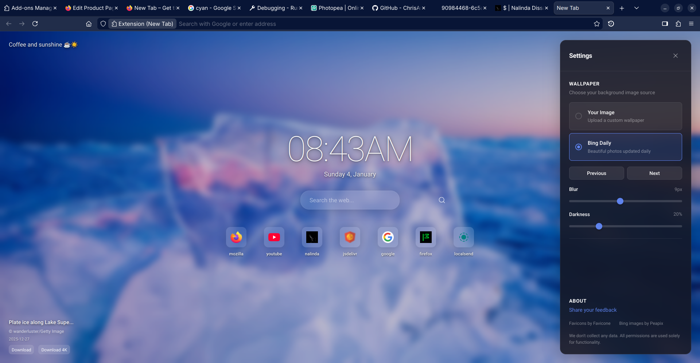
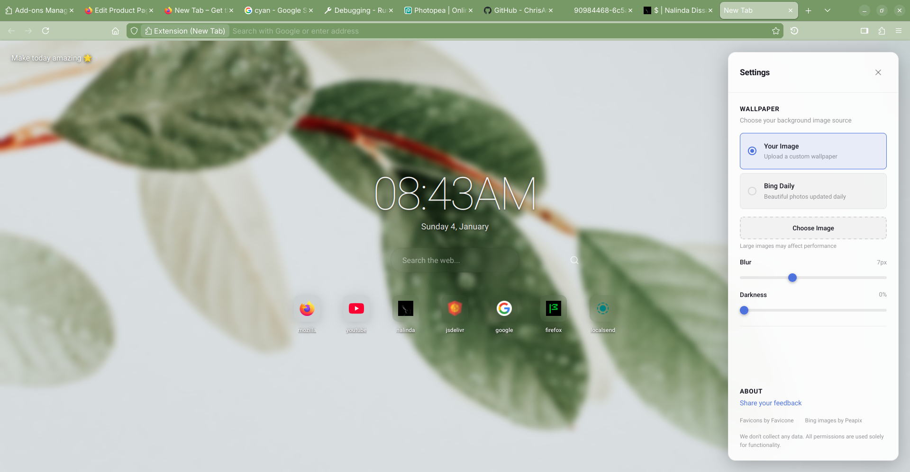

# New Tab

<!-- Keywords: nalindard, nalinda, nalinda.dev, Firefox new tab, Firefox extension, custom homepage -->

[](https://addons.mozilla.org/en-US/firefox/addon/nalinda-new-tab/)
[](https://nalinda.dev)

<p align="center">
  
</p>

A Firefox browser extension that transforms your new tab experience into something truly personal. Built with simplicity and privacy in mind, this extension replaces the default blank tab with a beautiful, customizable homepage while dynamically adapting your browser theme to match what you're viewing.

**[Install from Firefox Add-ons →](https://addons.mozilla.org/en-US/firefox/addon/nalinda-new-tab/)**

## What It Does

New Tab is designed to make Firefox feel like yours. Instead of opening to a generic blank page, every new tab becomes a canvas featuring stunning photography, your most-visited sites, and a simple task manager to keep you focused.

The standout feature is dynamic theme adaptation. The extension analyzes the average color of your current tab and adjusts the browser interface, including toolbars, URL bar, sidebars, and popup menus, to complement it. This creates a cohesive visual experience that changes as you browse, making your browser feel alive and responsive.

## Features

<p align="center">
  
  
</p>

### Dynamic Browser Theming

The extension captures a screenshot of your active tab, calculates the average color, and applies a harmonious theme across the entire browser chrome. It respects your system's light or dark mode preference, adjusting the theme accordingly for comfortable viewing at any time of day.

### Custom Homepage

Your new tab page includes:

-   **Live Clock**: Displays current time and date in a clean, readable format
-   **Contextual Greetings**: Time-based messages that change throughout the day, from early morning motivation to late night acknowledgment
-   **Quick Search**: A search bar that integrates directly with your browser's search engine
-   **Top Sites**: Visual shortcuts to your most frequently visited websites with favicon previews

### Wallpaper System

Choose your backdrop from two sources:

-   **Bing Daily Images**: Access the archive of Bing's featured photography, with previous/next navigation to browse through recent selections. Each image includes attribution, and you can download the original in standard or 4K resolution.
-   **Personal Images**: Upload your own wallpaper for a completely custom look. The image is stored locally.

### Task Manager

A simple sidebar-based task list to keep track of what you need to do. Add tasks, view your list, and remove completed items. All tasks persist across browser sessions using local storage.

### Top Sites Grid

Quick access tiles for your most frequently visited websites, displaying up to seven sites with their favicons and simplified titles. Local development URLs are automatically filtered out for a cleaner presentation.

## Privacy

This extension does not collect any personal data. All permissions requested are strictly for functionality:

-   **storage**: Save your preferences, wallpaper choice, and tasks locally
-   **search**: Enable the integrated search functionality
-   **bookmarks**: Access bookmark data for potential future features
-   **theme**: Apply dynamic theme changes to browser chrome
-   **topSites**: Display your frequently visited sites
-   **tabs/activeTab**: Capture tab screenshots for color analysis
-   **scripting**: Inject content scripts for theme detection

Everything stays on your machine. Your browsing habits, tasks, and preferences never leave your browser.

**[Install from Firefox Add-ons →](https://addons.mozilla.org/en-US/firefox/addon/nalinda-new-tab/)**

Or for manual/development installation:

1. Clone or download this repository
2. Open Firefox and navigate to `about:debugging`
3. Click "This Firefox" in the left sidebar
4. Click "Load Temporary Add-on"
5. Select the `manifest.json` file from this project

## Project Structure

```
HomePage.PP/
├── manifest.json          # Extension configuration and permissions
├── homepage.html          # New tab page structure
├── homepage.css           # Styling with dark/light mode support
├── popup.html             # Browser action popup
├── popup.css              # Popup styling
├── icons/                 # Extension icons in various sizes
└── js/
    ├── homepage.js        # Main homepage logic
    ├── service_worker.js  # Background script for theme management
    ├── contentScript.js   # Injected script for color scheme detection
    └── popup.js           # Popup functionality
```

## Technical Notes

The extension uses Manifest V3 and is built specifically for Firefox. The dynamic theming works by:

1. Capturing a screenshot of the visible tab
2. Drawing it to a canvas element
3. Iterating through pixels to calculate the average RGB color
4. Converting to HSL for better shade generation
5. Applying computed colors to all browser theme elements

The system adapts its approach based on whether you prefer dark or light mode, ensuring readability and visual harmony in both conditions.

## Development

The codebase uses vanilla JavaScript with no build step required. To develop:

1. Make changes to the source files
2. In `about:debugging`, click "Reload" on the extension
3. Open a new tab to see homepage changes, or navigate to any page to test theme updates

## Author

Developed by Nalinda Dissanayake

Website: [nalinda.dev/#contacts](https://nalinda.dev/#contacts/)

---

## Data Sources and Acknowledgments

This extension relies on third-party services to provide certain features, and I want to be transparent about their usage and express genuine gratitude.

### Peapix API

The Bing daily wallpaper feature fetches image data from [Peapix](https://peapix.com), which provides access to Bing's beautiful photography collection. I am grateful for this service that makes stunning imagery accessible.

I want to be clear about my intentions regarding this integration:

-   **Removal on Request**: If the maintainers of Peapix or Bing ever request that I stop using their service or data, I will remove this integration immediately and without question. No legal action would be necessary; a simple email is enough.
-   **Photographer Attribution**: The images featured through this service are the creative work of talented photographers. I display their attribution as provided in the API response. If any original photographer wishes to discuss usage, I am completely open to that conversation and willing to hand over any credentials or cease usage of their specific work.
-   **No Commercial Intent**: This extension is a personal project with no commercial motivation. The integration exists purely to enhance the browsing experience for users who appreciate beautiful photography.

Thank you to everyone at Peapix for maintaining this service and making it available.

### Favicone

Website favicons for the top sites grid are provided by [Favicone](https://favicone.com). This service delivers high-quality icons that make the interface more visually appealing. Similar to above, I am happy to remove this integration if requested by the service operators.

---

If you have questions, concerns, or just want to share feedback, I would love to hear from you. Reach out through the [contact page](https://nalinda.dev/#contacts).

<!-- SEO: nalindard nalinda nalinda.dev Firefox new tab extension homepage custom wallpaper Bing daily -->
